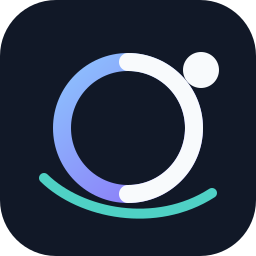

# Perigee



Moonlight, brought closer.

Perigee is a remote gaming and workstation client for Linux. It uses the current Moonlight Qt streaming core.

Perigee adds an in-stream control menu named Perigee Deck. Open Deck with one shortcut or one controller chord.

Version 0.1.0 is under development. It is not a production release.

## Purpose

Perigee reduces the number of shortcuts that you must remember during a stream. Deck gives you one searchable menu for session controls.

Perigee works with standard Sunshine hosts. A Polaris host can add only the enhanced controls that it advertises.

## Implemented features

- Open Deck from a keyboard or controller. Use a keyboard, mouse, or controller inside Deck.
- Show keyboard prompts when no client controller is open. Show controller prompts when the client opens a controller.
- Ignore Caps Lock when Perigee checks the Deck keyboard shortcut.
- Search actions in the Display, Quality, Input, Clipboard, Stats, Window, and Session categories.
- Navigate all core actions without text input.
- Show current values, progress, disabled reasons, confirmations, and verified results.
- Keep remote input neutral while Deck owns keyboard and controller input.
- Restore the intended input-capture state when Deck closes.
- Control mouse capture, keyboard capture, statistics, and window mode locally.
- Disconnect the client or quit Perigee without ending the host session.
- Select a physical host display with a keyboard, a pointer, or a controller.
- Send the standard GameStream display shortcut. Perigee does not require a modified Polaris or Sunshine host.
- Mark a display as **Last requested** only after a fresh video frame arrives.
- Keep Deck open if video verification times out. Perigee does not scan displays or claim host readback.
- Show the configured stream bitrate on standard Sunshine hosts.
- Change a Polaris stream between **Manual quality** and **Adaptive quality** when the host permits live tuning.
- Raise or lower the Polaris target bitrate in 5 megabit per second (Mbps) steps.
- Show controller glyphs for Xbox, PlayStation, Nintendo, and Steam Deck layouts.
- Preserve ordinary Moonlight shortcuts and controller input while Deck is closed.

Automated tests cover these features with local fixtures and a fake Polaris service. Linux packages pass a cold-artifact gate before publication.

The standard Sunshine path does not start Polaris discovery. Deck pointer targets retain clicks during list changes and list movement.

A bounded standard Sunshine stream test passed on the authorized staging path. The client decoded H.264 video and received video and audio packets.

Live keyboard, pointer, and physical-display acceptance passed on the Linux staging path. Controller navigation and full Polaris quality acceptance are pending.

See the [live acceptance ledger](docs/testing/live-acceptance-2026-08.md) for the current release gate. It contains redacted results only. Exact host evidence stays in an ignored local file.

## Current limitations

- Perigee can stream only one active host display at a time.
- Perigee does not open concurrent displays in separate client windows.
- Perigee labels physical displays as **Display 1** through **Display 13**. The host does not supply names or previews.
- The **Last requested** value is not an authoritative active-display value.
- You must set the number of physical display items that Deck shows. The permitted range is 1 through 13.
- Polaris named commands, text clipboard transfer, and host-session control are not live-qualified.
- A named command must use an identifier that the Polaris host advertises. Perigee does not provide an arbitrary shell.
- Clipboard transfer supports UTF-8 text only. The absolute client limit is 1 mebibyte (MiB).
- The automatic Moonlight update feed is disabled. Perigee 0.1.0 has no replacement update feed.
- Perigee 0.1.0 does not have a public release package. Build the source or use a verified artifact from the project workflow.
- Standard Sunshine does not support a Moonlight request to change bitrate during an active stream.
- Polaris live quality control requires advertised capabilities, owner permission, and valid settings readback.
- A separate **Smart quality** mode is deferred. The current Polaris API links adaptive bitrate and its artificial intelligence (AI) optimizer.
- Live controller and full Polaris quality acceptance are not complete.
- Standard Sunshine launch, video, audio, Deck pointer input, and physical display selection passed on the Linux staging path.
- Windows and macOS packaging inputs use the Perigee identity. Native release qualification is pending.
- Flatpak packaging is not part of version 0.1.0.
- Existing translation catalogs have not received a complete Perigee terminology update.

## Architecture and compatibility

The Moonlight Qt core remains responsible for video, audio, pairing, transport, decoding, rendering, and remote input.

Perigee adds these focused layers:

- `ActionRegistry` supplies stable actions, capability checks, permissions, confirmation rules, and result state.
- `GameStreamAdapter` supplies local actions for standard Sunshine and GameStream-compatible sessions.
- `PolarisAdapter` adds authenticated discovery for capabilities that the Polaris host advertises.
- Deck renders the user interface with Qt's QML declarative language and the existing stream overlay path.
- The input router neutralizes remote input and gives Deck temporary local ownership.

| Host | Stream path | Local Deck actions | Physical display request | Live quality control | Enhanced host actions |
|---|---|---|---|---|---|
| Standard Sunshine | GameStream-compatible | Available | Standard input shortcut | Configured bitrate is read-only | Not applicable |
| Polaris | GameStream-compatible | Available | Standard input shortcut | Advertised official capabilities only | Advertised official capabilities only |

The first release target is Nobara Linux with KDE Plasma and Wayland. Perigee requires Qt 6.7 or newer.

The client keeps the inherited H.264, HEVC, AV1, high dynamic range (HDR), audio, gamepad, and remote-desktop paths.

Host and hardware support still apply.

## Installation

Perigee does not have a public release package. Use a local development build or a verified Linux artifact from this repository's successful build workflow.

The workflow verifies each Linux artifact in the same environment that produced it. Do not install an artifact from a failed or incomplete workflow.

Do not use Moonlight release packages as Perigee packages. Those packages have a different identity and settings namespace.

On first applicable start, Perigee can import recognized Moonlight Qt preferences and paired hosts. The default answer is **No**.

An accepted import copies only recognized streaming preferences and complete paired-host records. It also copies the required pairing identity for imported hosts.

The import does not copy Deck bindings, logs, crash data, cached artwork, temporary state, or unknown keys.

## Build

Install a C++17 compiler, Qt 6.7 or newer, qmake, and the required development libraries.

For Fedora or Nobara, use these upstream-derived package names:

```text
openssl-devel SDL2-devel SDL2_ttf-devel ffmpeg-devel libva-devel
libvdpau-devel opus-devel pulseaudio-libs-devel alsa-lib-devel
libdrm-devel qt6-qtsvg-devel qt6-qtdeclarative-devel
```

The FFmpeg development package can require RPM Fusion on Fedora-family systems.

For Debian or Ubuntu, use these upstream-derived package names:

```text
libegl1-mesa-dev libgl1-mesa-dev libopus-dev libsdl2-dev
libsdl2-ttf-dev libssl-dev libavcodec-dev libavformat-dev
libswscale-dev libva-dev libvdpau-dev libxkbcommon-dev
wayland-protocols libdrm-dev qt6-base-dev qt6-declarative-dev
libqt6svg6-dev qt6-wayland qml6-module-qtquick-controls
qml6-module-qtquick-templates qml6-module-qtquick-layouts
qml6-module-qtqml-workerscript qml6-module-qtquick-window
qml6-module-qtquick
```

Clone the source and its submodules:

```bash
git clone --recurse-submodules https://github.com/WonderwerksSoftware/perigee.git
cd perigee
```

If you already have the source, update its submodules:

```bash
git submodule update --init --recursive
```

Configure an out-of-source debug build:

```bash
mkdir -p build
cd build
qmake6 ../moonlight-qt.pro CONFIG+=debug
```

Build Perigee:

```bash
make -j"$(nproc)" debug
```

Check the built identity:

```bash
./app/perigee --version
```

The expected output is `Perigee 0.1.0`.

## Test

Install X virtual framebuffer (Xvfb) before you run the complete graphical suite.

Configure the test target from the build directory:

```bash
qmake6 ../moonlight-qt.pro CONFIG+=debug CONFIG+=perigee-tests
make -j"$(nproc)" debug
```

Run the focused identity and migration tests without a display:

```bash
QT_QPA_PLATFORM=offscreen SDL_VIDEODRIVER=dummy \
  ./tests/perigee-tests BrandingTest -silent
```

Run the complete suite with software rendering:

```bash
xvfb-run -a -s "-screen 0 1280x720x24" \
  env LIBGL_ALWAYS_SOFTWARE=1 QT_QPA_PLATFORM=xcb SDL_VIDEODRIVER=dummy \
  ./tests/perigee-tests -silent
```

Some integration tests create private loopback services. They do not require a live Polaris or Sunshine host.

## Keyboard and controller use

The default Deck keyboard shortcut is `Ctrl+Alt+Shift+Space`.

Caps Lock does not change this shortcut. Perigee checks the required keys and ignores the Caps Lock state.

The default Deck controller chord is `LB+RB+Back+Start`. Change both bindings in the Perigee settings.

Use these controls while Deck is open:

- Use the arrow keys, directional pad, or left stick to move.
- Press `Enter` or the controller confirm button to activate an item.
- Press `Escape` or the controller back button to go back or close Deck.
- Press `LB` or `RB` to change categories.
- Press `Y` to focus search when the platform supports text input.

Deck selects its button prompts from controllers that Perigee opens on the client machine. The connected host does not select these prompts.

The direct statistics chord remains `LB+RB+Back+X`.

The **Legacy direct disconnect** setting restores the original controller disconnect behavior. The keyboard shortcut still opens Deck.

## Physical display selection

Set **Physical displays in Deck** to the number of physical host displays. You can select a value from 1 through 13.

Deck shows one item for each configured display. Select **Display 1** through **Display 13** to send `Ctrl+Alt+Shift+F1` through `Ctrl+Alt+Shift+F13`.

Perigee waits for a fresh video frame after the request. If a frame arrives, Perigee marks the display as **Last requested**.

Perigee does not know the authoritative active physical display. It does not show connector names, host display names, or previews.

If verification times out, Deck stays open and shows the failure. Perigee can request the last verified display one time.

## Polaris behavior

Perigee uses the paired Moonlight client identity for Polaris Hypertext Transfer Protocol Secure (HTTPS) requests.

The client pins each HTTPS request to the paired host certificate.

The client uses authenticated capability, permission, endpoint, and session data. It does not infer support from a version string.

Unsupported or denied actions remain disabled with a reason. Perigee does not send guessed requests.

Perigee uses only the capabilities that the connected Polaris host advertises.

Physical display selection uses the GameStream input channel. It does not require a Polaris application programming interface (API) extension.

Polaris stream-display modes, virtual displays, and physical monitor indexes are different concepts. Perigee does not combine these concepts.

The **Quality** category shows the current bitrate and the reported quality mode. **Manual quality** disables Polaris AI Auto Quality.

**Adaptive quality** enables Polaris AI Auto Quality. Polaris can then use stream health, packet loss, and round-trip time to tune its encoder bitrate.

The bitrate actions change the target by 5 Mbps. Perigee applies the limits that Polaris reports and also enforces the API range.

Perigee accepts a quality change only when the response contains the requested value. It then refreshes the authenticated settings and session state.

Named-command execution accepts only advertised identifiers and structured values. The client has no free-form command field.

Automated tests cover named commands, text clipboard transfer, and host-session control. Live qualification of these actions is not complete.

## Standard Sunshine behavior

Perigee keeps the inherited GameStream-compatible streaming path for standard [Sunshine](https://github.com/LizardByte/Sunshine) hosts.

Local Deck actions and physical display requests are available without Polaris.

Physical display selection uses the standard Moonlight shortcut. Perigee does not change the Sunshine host.

Polaris-only actions are hidden or disabled when the host does not advertise them.

The **Quality** category shows the bitrate that the stream used at startup. Live Manual and Adaptive actions stay disabled with a reason.

Automated regression tests cover this boundary. A bounded standard Sunshine launch and video and audio test passed.

The client does not probe Polaris endpoints on an ordinary Sunshine host. Live input and Deck acceptance are not complete.

## Contributing

Keep Perigee changes separate from the inherited streaming core when practical. Preserve upstream names when they identify source, protocols, or libraries.

Add a failing test before each behavior change. Run the focused tests after each small change.

Before you submit a change, run the applicable complete suite. Then run this check:

```bash
git diff --check
```

Do not add credentials, pairing keys, certificates, clipboard contents, or private host data to tests or logs.

See [upstream-pins.md](docs/upstream-pins.md) for the reviewed Moonlight and Polaris baselines.

## License

Perigee is distributed under the GNU General Public License, version 3 or later. See [LICENSE](LICENSE).

Keep all source notices and dependency licenses when you redistribute the software. See [NOTICE.md](NOTICE.md) for project attribution.

## Upstream attribution

Perigee is a modified work based on [Moonlight Qt](https://github.com/moonlight-stream/moonlight-qt).

The streaming protocol implementation uses [Moonlight Common C](https://github.com/moonlight-stream/moonlight-common-c).

[Polaris](https://github.com/papi-ux/polaris) is the enhanced host integration target. [Artemis](https://github.com/wjbeckett/artemis) supplied user-experience inspiration only.

[Nova](https://github.com/papi-ux/nova) was a Polaris protocol and behavior reference only.

These projects do not sponsor or endorse Perigee. Their names identify upstream or reference work only.

## Documentation style

The documentation uses guidance from [ASD-STE100 Issue 9](https://www.asd-ste100.org/assets/files/ASD-STE100_ISSUE9.pdf), dated 2025-01-15.

The documentation uses short sentences, active voice, consistent terms, and American English spelling. It is not certified as ASD-STE100 compliant.

The [official current-issue page](https://www.asd-ste100.org/STE_downloads.html) identifies the current standard.
